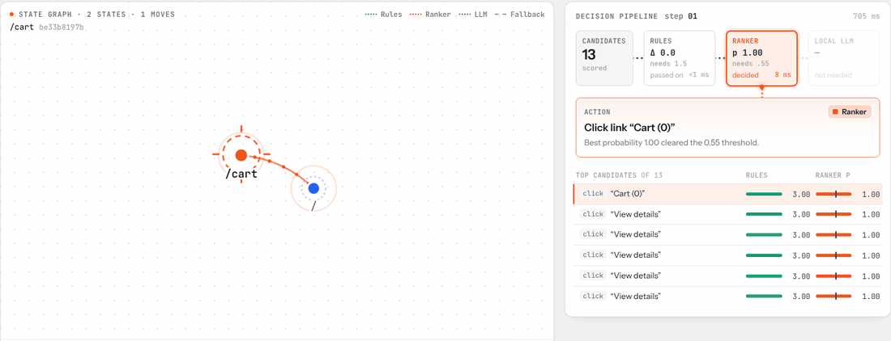
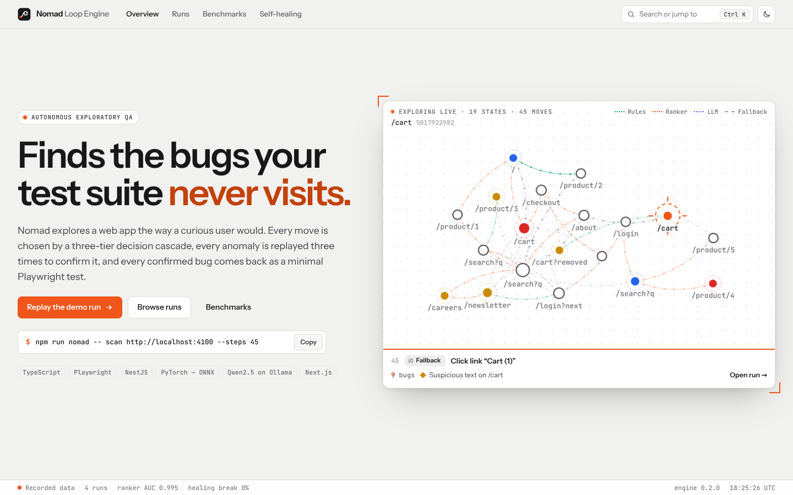
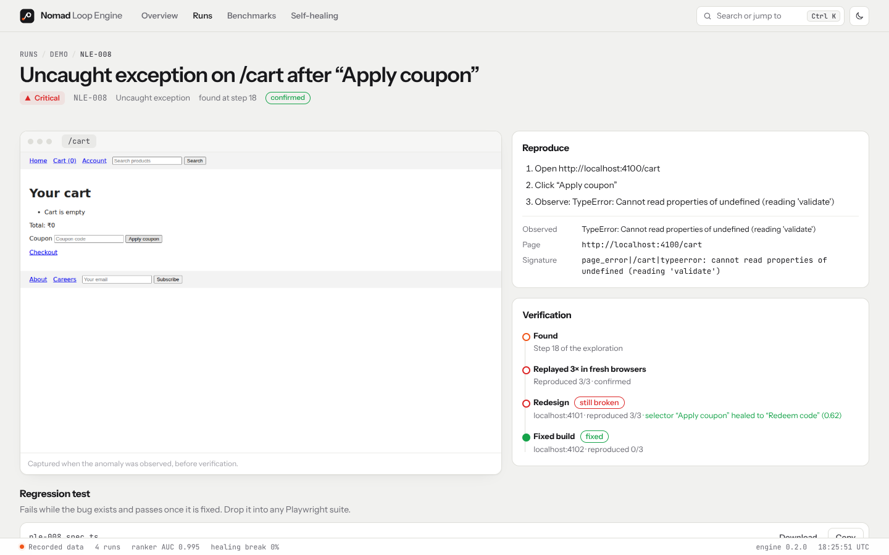
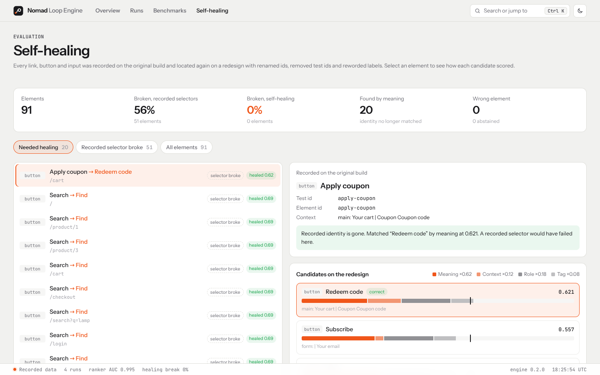
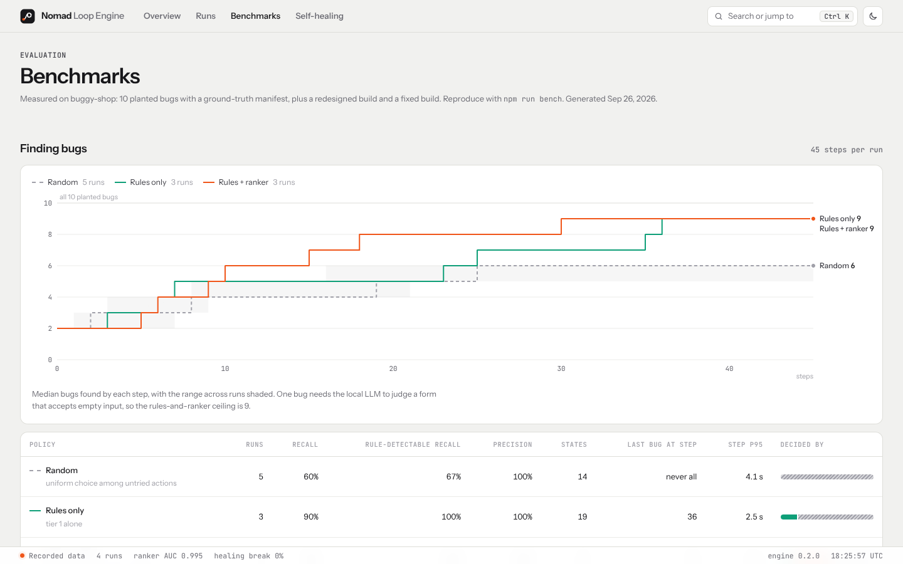
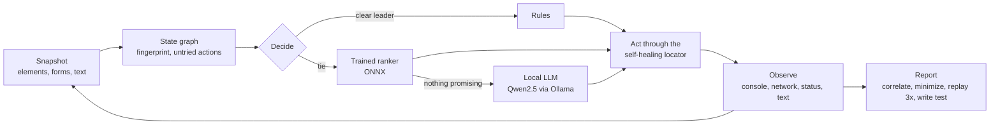

# Nomad Loop Engine

**[Live demo →](https://nomad-loop-engine.vercel.app)** · recorded runs, decision traces, bug evidence and benchmarks, nothing to install.

Autonomous exploratory testing for web apps. Nomad explores an application the way a user would, finds bugs, and hands back a Playwright test for each one. When the UI changes underneath it, it finds its elements again by meaning instead of failing on stale selectors.



| Overview                                                                                                      | Bug evidence                                                                                         |
| ------------------------------------------------------------------------------------------------------------- | ---------------------------------------------------------------------------------------------------- |
|  |           |
| **Self-healing inspector**                                                                                    | **Benchmarks**                                                                                       |
|                                 |  |

- **Explores on its own.** Clicks, fills and submits forms, and navigates, keeping a graph of every UI state so it never repeats an action.
- **Decides in three tiers.** Novelty rules, then a ranker trained on its own exploration logs, then a local LLM only when the ranker sees nothing promising. Every step records why.
- **Reports bugs you can act on.** Each report is correlated, minimized, replayed three times to rule out flakes, and ships with a regression test.
- **Heals its own selectors.** Recorded identity first; if that is gone, the element is found by what it is and where it sits.

## Results

Measured by `npm run bench` on [`targets/buggy-shop`](targets/buggy-shop), a storefront with 10 planted bugs and a ground-truth manifest, a redesigned build and a fixed build. Method and limits: [docs/benchmarks.md](docs/benchmarks.md).

|                                                       | Random    | Rules only | Rules + ranker |
| ----------------------------------------------------- | --------- | ---------- | -------------- |
| Rule-detectable planted bugs found (45 steps, median) | 67%       | **100%**   | **100%**       |
| Step at which the last bug was found                  | never all | 36         | **30**         |
| Precision (reports that are real planted bugs)        | 100%      | 100%       | 100%           |
| Step latency, p95                                     | 4.1 s     | 2.5 s      | 2.1 s          |

| Check                                                                    | Result                                |
| ------------------------------------------------------------------------ | ------------------------------------- |
| Reports on the fixed build, 45 steps                                     | **0** false positives                 |
| Generated tests that fail on the buggy build / pass on the fixed build   | **9 / 9** and **9 / 9**               |
| Selectors broken by the redesign: recorded vs self-healing (91 elements) | 56% vs **0%**, 0 wrong elements       |
| Bugs replayed across the redesign (only reachable through healing)       | 9 / 9 still reproduced                |
| Ranker ROC AUC on held-out runs (885 actions, 17 runs)                   | **0.995** (best single feature: 0.65) |
| Ranker precision at its decision threshold vs base rate                  | 90% vs 27%                            |

These are one app's numbers. The ranker is tested on unseen runs of the same app, not unseen apps; the local LLM was not running for them.

## How it works



| Part             | In short                                                                         | Details                                                         |
| ---------------- | -------------------------------------------------------------------------------- | --------------------------------------------------------------- |
| Decision policy  | Each tier decides or escalates; traces show candidate scores per tier            | [ADR 0001](docs/adr/0001-hybrid-decision-policy.md)             |
| Self-healing     | `0.62 · meaning + 0.18 · role + 0.12 · context + 0.08 · tag`, abstain below 0.62 | [ADR 0002](docs/adr/0002-semantic-self-healing.md)              |
| Bug reports      | Correlated symptoms, minimized recipes, 3× replay, typed assertions              | [ADR 0003](docs/adr/0003-repro-minimization-and-flake-check.md) |
| Storage and jobs | Run folders + in-process queue, or Postgres + BullMQ, behind one contract        | [ADR 0004](docs/adr/0004-storage-and-queue-adapters.md)         |

Architecture overview: [docs/architecture.md](docs/architecture.md).

## Quick start

Requires Node 20+. Python 3.11 and Ollama are optional.

```bash
npm install
npx playwright install chromium
npm run build
```

**Explore the seeded app from the CLI**

```bash
npm run target &                                   # buggy-shop on :4100
npm run nomad -- scan http://localhost:4100 --steps 45 \
  --manifest targets/buggy-shop/bugs.manifest.json
```

Each run writes `runs/<run-id>/` with the event log, bug reports, screenshots, state thumbnails and one `.spec.ts` per bug.

**Open the dashboard**

```bash
npm --workspace @nomad/web run dev                  # http://localhost:3000
```

Without an API it shows the recorded benchmark runs. Press ⌘K (Ctrl K) anywhere to jump to a run, a bug or a page; the theme toggle switches between light and dark. To watch live runs, start the API and point the dashboard at it:

```bash
npm --workspace @nomad/api run start                # http://localhost:8100, docs at /docs
NEXT_PUBLIC_API_URL=http://localhost:8100 npm --workspace @nomad/web run dev
```

**Add the models**

```bash
cd services/ml
python -m venv .venv && source .venv/bin/activate
pip install -r requirements.txt
ollama pull qwen2.5:3b-instruct                    # qwen2.5:7b-instruct with 8 GB+ VRAM
uvicorn app:app --port 8200
```

Then pass `--ml-url http://localhost:8200` to the CLI, or set `ML_URL` for the API. Without it, Nomad runs rules-only with offline embeddings.

**Full stack in containers** (Postgres, Redis, API, ML service, dashboard, the three target builds)

```bash
docker compose up --build
```

## CLI

```
nomad scan <url>                  explore, report, write tests
  --steps 60 --ml-url <url> --policy hybrid|random --seed <n>
  --manifest <file> --min-recall 1 --min-precision 1    quality gate for CI
  --fail-on minor|major|critical                        exit 1 on confirmed bugs
  --json                                                machine-readable output
nomad sweep <run-dir> <url>       replay a run's bugs on another build: fixed / still broken / flaky
nomad score <run-dir> <manifest>  recall and precision against ground truth
nomad heal-bench <v1> <v2> --spec redesign.json
```

A reusable GitHub Action wraps `nomad scan`:

```yaml
- uses: <owner>/nomad-loop-engine@v1
  with:
    url: http://localhost:3000
    fail-on: major
```

## API

OpenAPI docs are served at `/docs`. Live events stream over Socket.IO (namespace `/live`, emit `subscribe` with a run or sweep id).

| Method | Path                                     |                                                      |
| ------ | ---------------------------------------- | ---------------------------------------------------- |
| `POST` | `/runs`                                  | Queue an exploration                                 |
| `GET`  | `/runs`, `/runs/:id`, `/runs/:id/events` | Runs, one run with its graph and bugs, its event log |
| `POST` | `/runs/:id/stop`                         | Stop after the current step                          |
| `GET`  | `/runs/:id/bugs/:bugId/repro`            | The generated test                                   |
| `GET`  | `/runs/:id/files/:dir/:name`             | Screenshots, state thumbnails, tests                 |
| `POST` | `/sweeps`                                | Replay a run's bugs against another build            |
| `GET`  | `/sweeps`, `/sweeps/:id`                 | Sweep results                                        |
| `GET`  | `/health`, `/metrics`                    | Component status, Prometheus metrics                 |

Postgres and BullMQ turn on with `DATABASE_URL` and `REDIS_URL`; see [apps/api/.env.example](apps/api/.env.example).

## Repository

```
packages/contracts   shared types and zod request schemas
packages/engine      exploration loop, policy, locator, reporter, sweeps, CLI
apps/api             NestJS: runs, sweeps, live stream, artifacts, OpenAPI, metrics
apps/web             Next.js dashboard: overview, runs, replay, decision pipeline, bugs, healing, benchmarks
services/ml          FastAPI: ONNX ranker and trainer, embeddings, Ollama bridge
targets/buggy-shop   seeded target: bug manifest, redesign, fixed build
benchmarks           harness and results behind every number above
docs                 architecture, decisions, benchmark method
```

## Development

```bash
npm run lint && npm run typecheck
npm test                                            # engine and API tests
cd services/ml && pytest -q
DATABASE_URL=... REDIS_URL=... npm --workspace @nomad/api test   # adapter contract tests on real services
```

CI runs lint, types and unit tests; the API tests against Postgres and Redis service containers; the ML tests; a quality gate that explores buggy-shop and fails below 100% rule-detectable recall or precision; and a sweep of the generated bugs on the fixed build.

## Next

- Runs against open-source apps, with confirmed bugs filed upstream
- Ranker training across several apps; hand-set healing weights fitted on labelled redesigns
- Benchmark against a hosted-model-only policy for bugs found, cost and latency
- Authenticated flows (sign in once, reuse storage state)

## License

MIT
