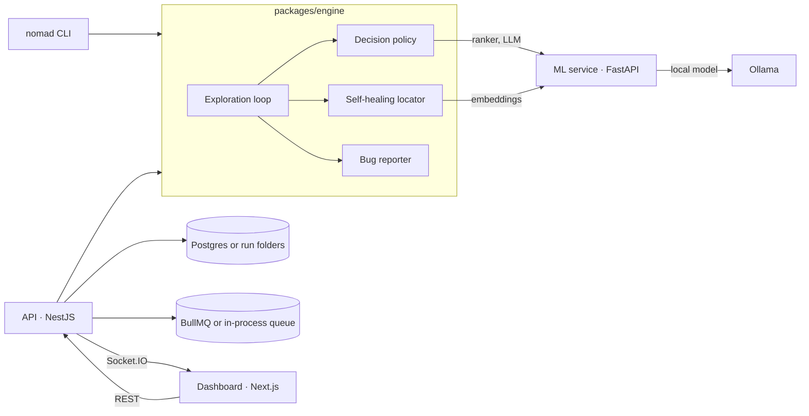
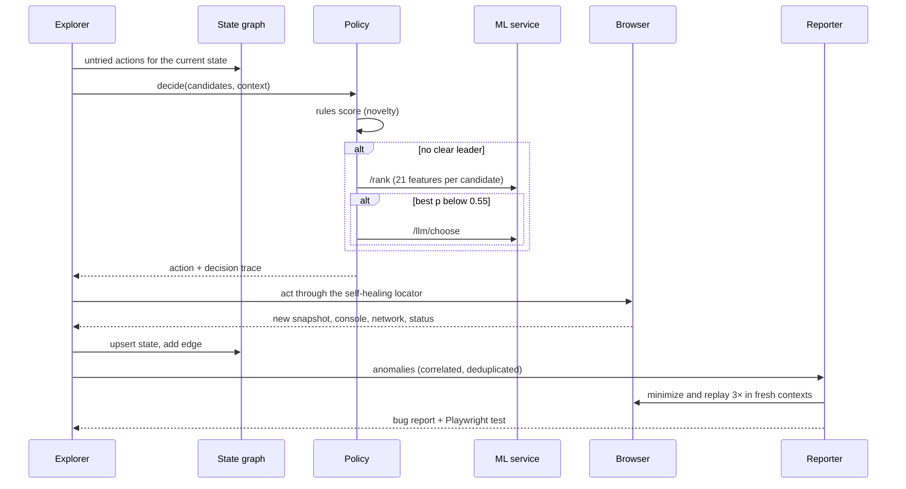

# Architecture

Nomad Loop Engine is a monorepo with one engine library and three thin shells around it: a CLI, a NestJS API, and a Next.js dashboard. A Python service hosts the models.

| Package              | Role                                                                                                           |
| -------------------- | -------------------------------------------------------------------------------------------------------------- |
| `packages/contracts` | Domain types and zod request schemas shared by every TypeScript package                                        |
| `packages/engine`    | Exploration loop, state graph, hybrid policy, self-healing locator, anomaly detection, reporter, sweeps, CLI   |
| `apps/api`           | Queues runs and sweeps, persists results, streams events, serves artifacts, OpenAPI docs, Prometheus metrics   |
| `apps/web`           | Overview, runs, replay with the decision pipeline, bug evidence, self-healing inspector, benchmarks, ⌘K search |
| `services/ml`        | ONNX ranker inference and training, MiniLM embeddings, Ollama bridge                                           |
| `targets/buggy-shop` | Seeded target app with a bug manifest, a redesigned layout and a fixed build                                   |
| `benchmarks`         | Harness that produces every number in the README                                                               |

## One exploration step

## State identity

A state is a fingerprint of the normalized path (query keys only) plus the set of interactive elements by role and accessible name, with digits masked. `Cart (2)` and `Cart (3)` are the same state; a page whose buttons change is a new one. Actions are keyed per state, so an action is never retried from the same state; dead ends jump back to the oldest state with untried actions.

## Decision policy

Three tiers, each either decides or escalates. Every decision carries a trace of what each tier saw, which the dashboard renders per step. See [ADR 0001](adr/0001-hybrid-decision-policy.md).

## Self-healing

Elements are recorded as descriptors (role, accessible name, placeholder, link target, ids, CSS path, landmark and neighbour context). Recorded identity is tried first; when it no longer matches, candidates are scored by meaning. See [ADR 0002](adr/0002-semantic-self-healing.md).

## Bug reports

Detectors cover server errors, broken links, console errors, uncaught exceptions, failed and slow requests, broken images and suspicious rendered text. Symptoms of one cause are merged, reports are minimized and replayed three times, and each comes with a Playwright test that fails while the bug exists. See [ADR 0003](adr/0003-repro-minimization-and-flake-check.md).

## Persistence and jobs

The API runs with zero setup (run folders on disk, in-process queue) or in production mode (Postgres, BullMQ on Redis) by setting `DATABASE_URL` and `REDIS_URL`. Both implementations pass the same contract tests. See [ADR 0004](adr/0004-storage-and-queue-adapters.md).

## Events

Everything a run does is an ordered event: `run_started`, `node_added`, `edge_added`, `step` (with the decision trace), `bug`, `heal`, `stats`, `run_finished`. The same log drives the CLI output, the WebSocket stream, the dashboard replay and the metrics, so a recorded run and a live run render identically.
